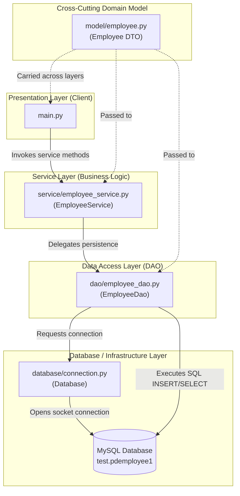
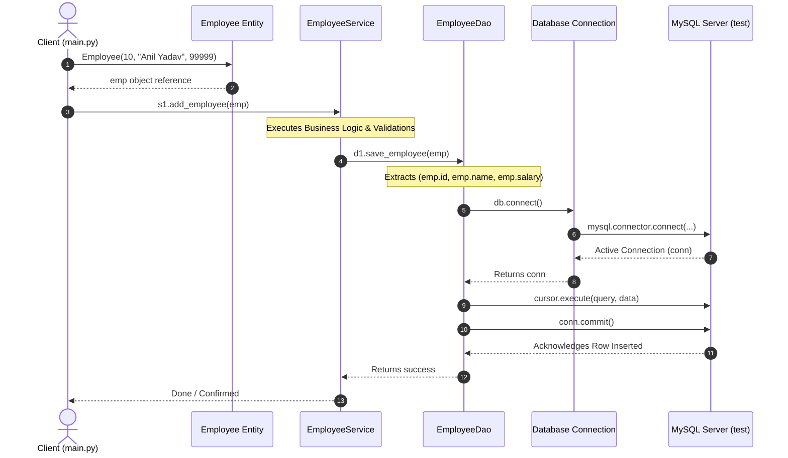
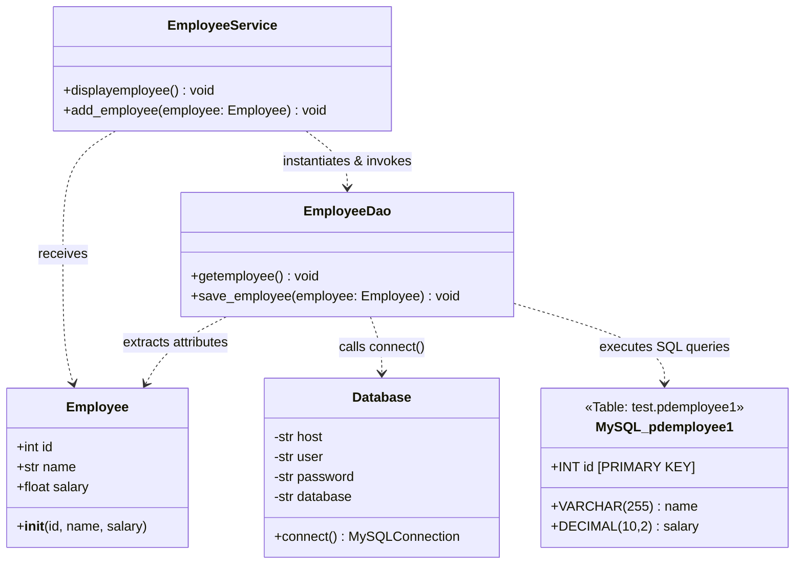

# Complete Architectural Guide: Layered (N-Tier) Architecture Pattern

This document provides an exhaustive, in-depth explanation of the **Layered Architecture Pattern** implemented in the [`/home/anil/Desktop/Layered`](file:///home/anil/Desktop/Layered) project. It covers core software engineering principles, component breakdowns, data flows, UML modeling, security considerations, and production best practices.

---

## Table of Contents
1. [Introduction to Layered Architecture](#1-introduction-to-layered-architecture)
2. [Architectural Overview & Structural Hierarchy](#2-architectural-overview--structural-hierarchy)
3. [Component Breakdown & Layer Responsibilities](#3-component-breakdown--layer-responsibilities)
   - [Presentation / Client Layer (`main.py`)](#presentation--client-layer-mainpy)
   - [Domain Model / DTO Layer (`model/employee.py`)](#domain-model--dto-layer-modelemployeepy)
   - [Business Logic / Service Layer (`service/employee_service.py`)](#business-logic--service-layer-serviceemployee_servicepy)
   - [Data Access Object Layer (`dao/employee_dao.py`)](#data-access-object-layer-daoemployee_daopy)
   - [Infrastructure / Database Layer (`database/connection.py`)](#infrastructure--database-layer-databaseconnectionpy)
4. [End-to-End Execution & Data Flow Analysis](#4-end-to-end-execution--data-flow-analysis)
5. [UML Class Diagram & Relational Mapping](#5-uml-class-diagram--relational-mapping)
6. [Architectural Comparison: Monolithic vs. Layered Pattern](#6-architectural-comparison-monolithic-vs-layered-pattern)
7. [Annotated Source Code Walkthrough](#7-annotated-source-code-walkthrough)
8. [Production Improvements & Enterprise Best Practices](#8-production-improvements--enterprise-best-practices)

---

## 1. Introduction to Layered Architecture

**Layered Architecture** (also referred to as **N-Tier Architecture**) is one of the most widely adopted architectural patterns in enterprise software engineering. In this pattern, the application is organized into horizontal layers, where each layer has a **specific, isolated responsibility** and interacts only with its neighboring layers.

### Core Software Engineering Principles:
- **Separation of Concerns (SoC):** Distinct tasks (user interaction, business rules, data persistence, and database connection) are partitioned into isolated modules.
- **Single Responsibility Principle (SRP):** Each class and module has only one reason to change.
- **Loose Coupling:** Upper layers depend on abstractions or interfaces of lower layers rather than concrete low-level implementation details.
- **High Cohesion:** Code related to a specific domain (such as data access or business calculations) is kept together.
- **Maintainability & Testability:** Each layer can be tested, modified, or replaced independently without triggering breaking changes throughout the system.

---

## 2. Architectural Overview & Structural Hierarchy

The [`/home/anil/Desktop/Layered`](file:///home/anil/Desktop/Layered) codebase organizes functionality into distinct tiers with a cross-cutting domain entity model:




### Layer Interaction Rules:
1. **Unidirectional Calls:** Requests flow strictly downwards:
   $$\text{Presentation} \longrightarrow \text{Service} \longrightarrow \text{DAO} \longrightarrow \text{Database}$$
2. **Data & Result Propagation:** Responses, query records, and execution confirmations flow strictly upwards:
   $$\text{Database} \longrightarrow \text{DAO} \longrightarrow \text{Service} \longrightarrow \text{Presentation}$$
3. **Cross-Cutting Model:** The `Employee` class acts as a **Data Transfer Object (DTO)**, encapsulating data passed between layers without coupling layers to raw tuples or dictionaries.

---

## 3. Component Breakdown & Layer Responsibilities

The responsibility boundary of each file and module is strictly defined to prevent architectural leakage:


### Presentation / Client Layer (`main.py`)
- **Role:** Entry point and client interface.
- **Location:** [`/home/anil/Desktop/Layered/main.py`](file:///home/anil/Desktop/Layered/main.py)
- **Primary Responsibilities:**
  - Handles initial execution and prints welcome/system messages.
  - Instantiates domain model entities (`Employee`).
  - Instantiates and delegates work to the `EmployeeService`.
- **Strict Anti-Patterns (What it NEVER does):**
  - **Never** executes raw SQL queries.
  - **Never** directly imports or calls `Database` or `mysql.connector`.
  - **Never** performs database persistence directly.

### Domain Model / DTO Layer (`model/employee.py`)
- **Role:** Data encapsulation and transfer entity.
- **Location:** [`/home/anil/Desktop/Layered/model/employee.py`](file:///home/anil/Desktop/Layered/model/employee.py)
- **Primary Responsibilities:**
  - Holds clean state for employee records (`id`, `name`, `salary`).
  - Provides type consistency across layer boundaries.
- **Benefits:**
  - Avoids brittle index-based tuple unpacking (e.g., `row[0]`, `row[1]`).
  - Changes to fields can be modified in one unified definition.

### Business Logic / Service Layer (`service/employee_service.py`)
- **Role:** Business rules, workflows, and process orchestration.
- **Location:** [`/home/anil/Desktop/Layered/service/employee_service.py`](file:///home/anil/Desktop/Layered/service/employee_service.py)
- **Primary Responsibilities:**
  - Validates business requirements (e.g., validating salary bounds, checking name formatting).
  - Coordinates multi-step operations (e.g., checking if an employee already exists before creating a new one).
  - Instantiates and invokes `EmployeeDao`.
- **Strict Anti-Patterns:**
  - **Never** writes SQL statements (`INSERT`, `SELECT`, `UPDATE`, `DELETE`).
  - **Never** creates database connections or manages raw database drivers.

### Data Access Object Layer (`dao/employee_dao.py`)
- **Role:** Persistence abstraction and database communication.
- **Location:** [`/home/anil/Desktop/Layered/dao/employee_dao.py`](file:///home/anil/Desktop/Layered/dao/employee_dao.py)
- **Primary Responsibilities:**
  - Prepares parameterized SQL queries (`insert into pdemployee1(id,name,salary) values(%s,%s,%s)`).
  - Obtains a connection via `Database().connect()`.
  - Creates cursors, executes queries with bound parameter tuples, and commits transactions (`conn.commit()`).
  - Converts database result sets into domain objects.
- **Strict Anti-Patterns:**
  - **Never** validates business rules (e.g., salary rules).
  - **Never** prints directly to the end-user or parses CLI/HTTP inputs.

### Infrastructure / Database Layer (`database/connection.py`)
- **Role:** Database driver management and network connection factory.
- **Location:** [`/home/anil/Desktop/Layered/database/connection.py`](file:///home/anil/Desktop/Layered/database/connection.py)
- **Primary Responsibilities:**
  - Configures MySQL connection parameters (`host`, `user`, `password`, `database`).
  - Creates and returns open `mysql.connector` connection instances.
- **Strict Anti-Patterns:**
  - **Never** imports or knows about `Employee`, `EmployeeService`, or domain models.
  - **Never** runs specific application SQL queries.

---

## 4. End-to-End Execution & Data Flow Analysis

When [`main.py`](file:///home/anil/Desktop/Layered/main.py) executes the line:
```python
s1.add_employee(Employee(10, "Anil Yadav", 99999))
```
the complete sequence unfolds across five distinct execution stages:




### Detailed Trace of Each Stage:
1. **Model Instantiation:**
   [`main.py`](file:///home/anil/Desktop/Layered/main.py) invokes `Employee(10, "Anil Yadav", 99999)`. The constructor assigns `self.id = 10`, `self.name = "Anil Yadav"`, and `self.salary = 99999`.
2. **Service Invocation:**
   [`main.py`](file:///home/anil/Desktop/Layered/main.py) calls `s1.add_employee(emp)`. Execution crosses the boundary from the client layer into the business logic layer.
3. **DAO Invocation:**
   `EmployeeService` logs `"service adding new employee..."` and calls `d1.save_employee(employee)` on an `EmployeeDao` instance.
4. **Database Connection Acquisition:**
   `EmployeeDao` calls `Database().connect()`, which issues `mysql.connector.connect(host='localhost', user='root', password='...', database='test')` to retrieve an active socket connection.
5. **Parameterized Query Execution:**
   `EmployeeDao` constructs the parameterized query:
   ```python
   query = 'insert into pdemployee1(id,name,salary) values(%s,%s,%s)'
   data = (employee.id, employee.name, employee.salary)
   cursor.execute(query, data)
   conn.commit()
   ```
6. **Transaction Persistence & Confirmation:**
   `conn.commit()` sends the `COMMIT` signal to MySQL's InnoDB engine, ensuring that data is flushed to permanent disk storage. The console displays `"Data saved successfully!!"`.

---

## 5. UML Class Diagram & Relational Mapping

The structure of the classes and their database relational mapping is illustrated below:




### Object-Relational Field Mapping Table:

| Python Class Attribute (`model.employee.Employee`) | MySQL Column Name (`test.pdemployee1`) | MySQL Data Type | Constraints / Purpose |
| :--- | :--- | :--- | :--- |
| `self.id` | `id` | `INT` | Primary Key, Unique Identifier |
| `self.name` | `name` | `VARCHAR(255)` | Employee Full Name |
| `self.salary` | `salary` | `DECIMAL(10, 2)` | Precision Currency / Compensation |

---

## 6. Architectural Comparison: Monolithic vs. Layered Pattern

To understand why layered architecture is essential in enterprise systems, consider the direct comparison against a monolithic script:


### Key Architectural Metrics Comparison:

| Evaluation Metric | ❌ Monolithic Anti-Pattern (Single Script) | ✅ Layered Architecture Pattern |
| :--- | :--- | :--- |
| **Separation of Concerns** | None. UI, business logic, SQL, and DB drivers are tangled together. | Strict. Every file has one unambiguous, isolated role. |
| **Coupling** | **Tight Coupling:** Changing the database table or driver breaks the entire application. | **Loose Coupling:** Swapping MySQL for PostgreSQL requires changing only DAO/Database files. |
| **Testability** | Cannot unit-test business logic without a live, running MySQL database. | **100% Testable:** Mock DAO methods in unit tests without requiring a real database. |
| **Reusability** | Zero. Code cannot be imported into a REST API, web portal, or GUI. | **High:** `EmployeeService` can power CLI, Flask, FastAPI, Django, or desktop apps. |
| **Security** | Frequently leads to string concatenation and SQL Injection risks. | Centralizes query parametrization (`%s` placeholders) across all DAOs. |
| **Team Scalability** | Merge conflicts occur when multiple engineers edit the same single script. | UI developers, backend developers, and DBAs work concurrently in separate directories. |

---

## 7. Annotated Source Code Walkthrough

Below is the verified code from the [`/home/anil/Desktop/Layered`](file:///home/anil/Desktop/Layered) project with technical annotations:

### 1. `database/connection.py`
```python
import mysql.connector

class Database:
    def connect(self):
        # Centralized factory method to create and return MySQL connection
        conn = mysql.connector.connect(
            host = 'localhost',
            user = 'root',
            password = '1234',
            database = 'test'
        )
        return conn
```
- **Key Takeaway:** Centralizing connection creation means if the database port, host, or password changes, only this one method needs updating.

---

### 2. `model/employee.py`
```python
class Employee:
    def __init__(self, id, name, salary):
        self.id = id
        self.name = name
        self.salary = salary
```
- **Key Takeaway:** Acts as a strongly typed data container (DTO) that flows cleanly across application layers.

---

### 3. `service/employee_service.py`
```python
from dao.employee_dao import EmployeeDao

class EmployeeService:
    def displayemployee(self):
        # Orchestrates retrieval workflow
        print("Processing employee information...")
        d1 = EmployeeDao()
        d1.getemployee()
        
    def add_employee(self, employee):
        # Orchestrates creation workflow
        print("service adding new employee...")
        d1 = EmployeeDao()
        d1.save_employee(employee)
```
- **Key Takeaway:** Acts as an intermediary orchestrator. Business validations belong here before delegating to the DAO.

---

### 4. `dao/employee_dao.py`
```python
from database.connection import Database

class EmployeeDao:
    def getemployee(self):
        # Data retrieval logic
        db = Database()
        db.connect()
        print("Retrieving employee data...")
        
    def save_employee(self, employee):
        # Data persistence logic
        print("DAO saving employee data...")
        print(f"Employee ID: {employee.id}, Name: {employee.name}, Salary: {employee.salary}")
        db = Database()
        conn = db.connect()
        cursor = conn.cursor()
        
        # Parameterized query protects against SQL injection
        query = 'insert into pdemployee1(id,name,salary) values(%s,%s,%s)'
        data = (employee.id, employee.name, employee.salary)
        cursor.execute(query, data)
        conn.commit()
        print("Data saved successfully!!")
```
- **Key Takeaway:** Notice the use of `values(%s,%s,%s)` and the tuple `(employee.id, employee.name, employee.salary)`. This parameterized approach ensures values are escaped properly by the MySQL driver.

---

### 5. `main.py`
```python
from service.employee_service import EmployeeService
from model.employee import Employee

print("Welcome to our Website")
s1 = EmployeeService()

# Client creates domain entity and invokes business service
s1.add_employee(Employee(10, "Anil Yadav", 99999))
```
- **Key Takeaway:** Notice that `main.py` does not know or care that MySQL is being used behind the scenes. It only knows about `EmployeeService` and `Employee`.

---

## 8. Production Improvements & Enterprise Best Practices

While the current codebase demonstrates the layered architecture pattern cleanly, the following enhancements elevate it to enterprise production standards:

### 1. Connection Lifecycle & Resource Management
In the current DAO, database connections and cursors should always be closed to prevent memory leaks and database connection exhaustion:
```python
def save_employee(self, employee):
    db = Database()
    conn = db.connect()
    try:
        with conn.cursor() as cursor:
            query = 'INSERT INTO pdemployee1(id, name, salary) VALUES (%s, %s, %s)'
            data = (employee.id, employee.name, employee.salary)
            cursor.execute(query, data)
            conn.commit()
    except Exception as err:
        conn.rollback()  # Rollback on failure to keep DB consistent
        raise err
    finally:
        conn.close()     # Always return connection to pool
```

### 2. Dependency Injection (DI)
Rather than instantiating `d1 = EmployeeDao()` inside methods, pass dependencies via the constructor. This allows injecting mock DAOs during unit testing:
```python
class EmployeeService:
    def __init__(self, dao: EmployeeDao = None):
        self.dao = dao or EmployeeDao()

    def add_employee(self, employee: Employee):
        # Validation rules
        if employee.salary < 0:
            raise ValueError("Salary cannot be negative")
        self.dao.save_employee(employee)
```

### 3. Connection Pooling
Instead of creating a new TCP socket connection for every single query, use a connection pool:
```python
from mysql.connector import pooling

class Database:
    _pool = pooling.MySQLConnectionPool(
        pool_name="mypool",
        pool_size=5,
        host='localhost',
        user='root',
        password='1234',
        database='test'
    )

    @classmethod
    def get_connection(cls):
        return cls._pool.get_connection()
```

### 4. Environment-based Configuration
Avoid hardcoding database credentials in source code. Use environment variables or `.env` files:
```python
import os

class Database:
    def connect(self):
        return mysql.connector.connect(
            host=os.getenv("DB_HOST", "localhost"),
            user=os.getenv("DB_USER", "root"),
            password=os.getenv("DB_PASSWORD", ""),
            database=os.getenv("DB_NAME", "test")
        )
```

---

## Summary Checklist

- [x] **Separation of Concerns:** Each tier (`model`, `service`, `dao`, `database`, `main`) has a single, clear objective.
- [x] **Data Encapsulation:** The `Employee` class passes structured state cleanly across layers.
- [x] **SQL Injection Defense:** MySQL parameter tokens (`%s`) are used in DAO methods.
- [x] **Loose Coupling:** The client layer interacts strictly with the service layer, remaining agnostic of the underlying database engine.
- [x] **Visual Documentation:** High-resolution architectural diagrams and interactive sequence flow charts are embedded throughout the document.
