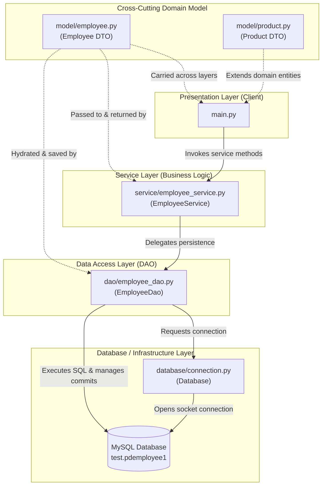
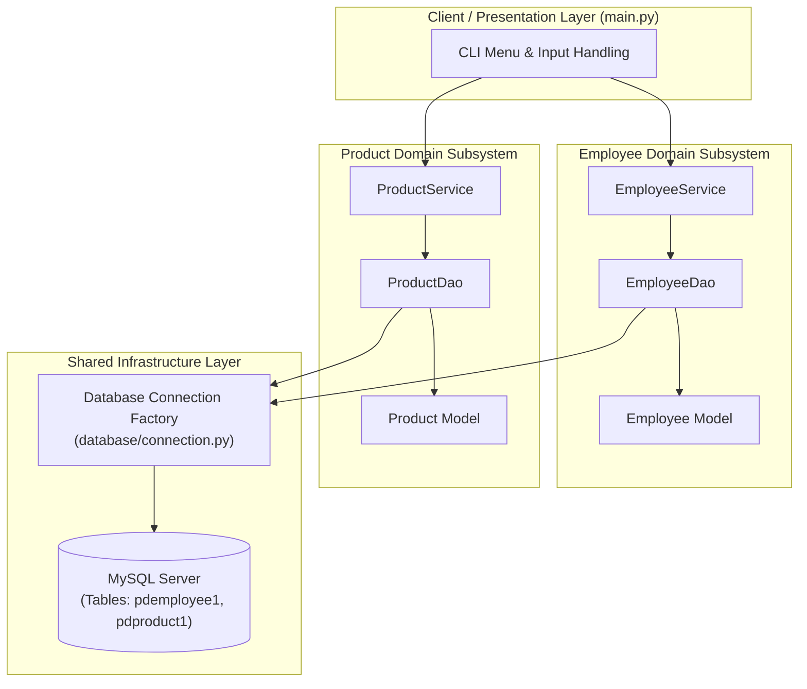
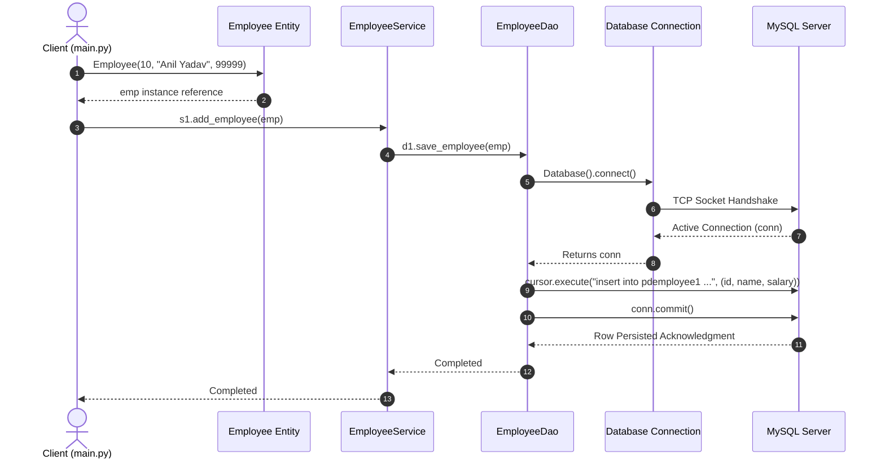
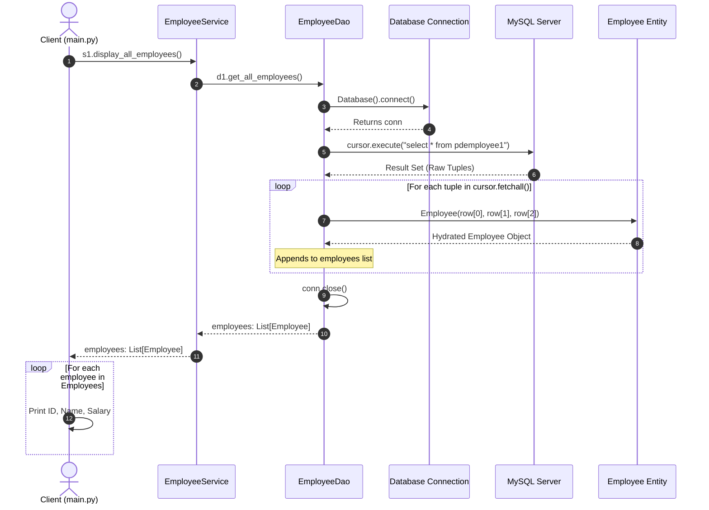
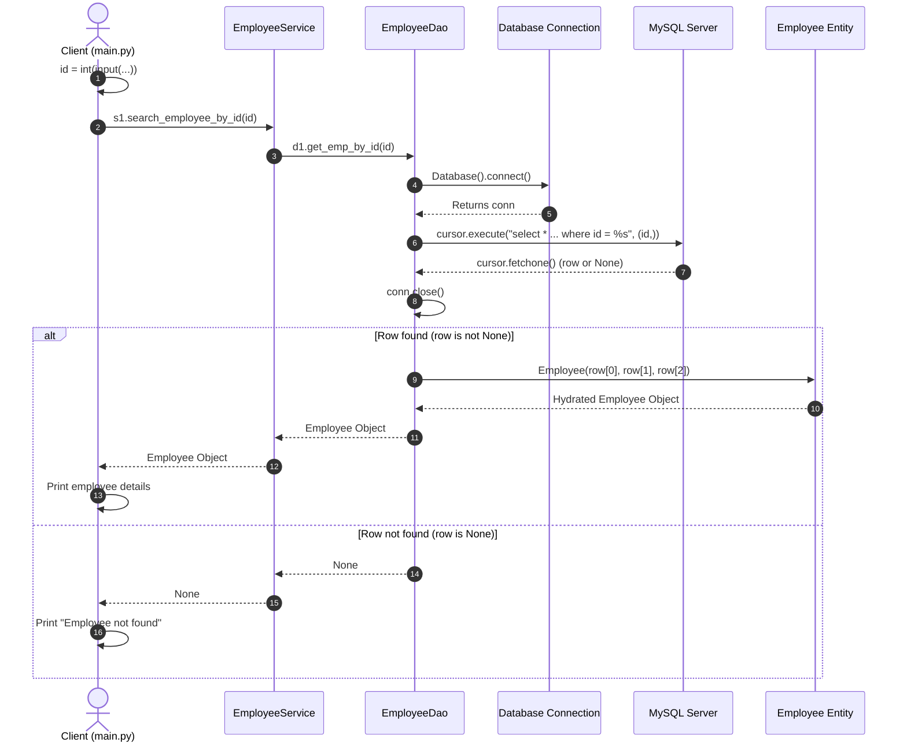
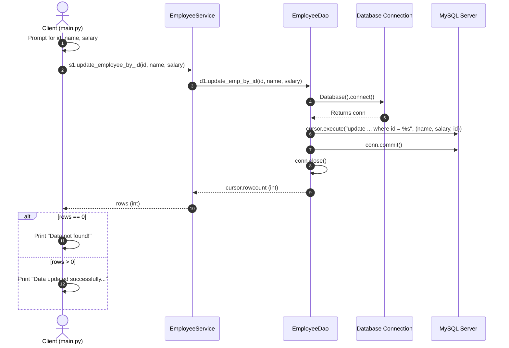
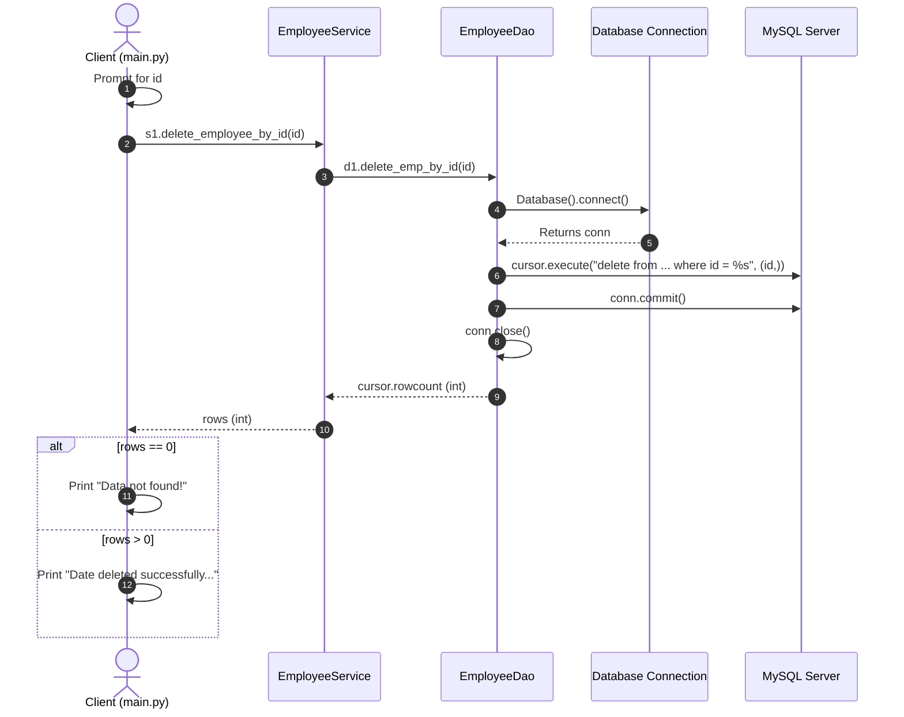
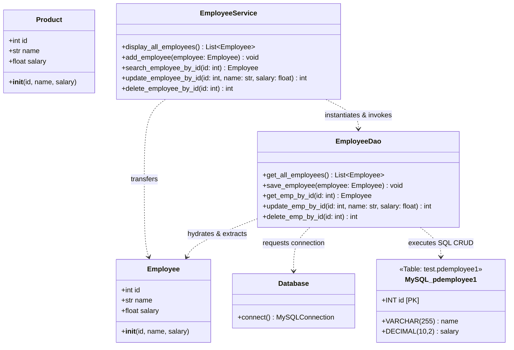

# Complete Architectural Guide: Layered (N-Tier) Architecture Pattern with PDBC

This document provides an exhaustive, in-depth theoretical and architectural breakdown of the **Layered (N-Tier) Architecture Pattern** implemented in the [`LayeredArchitecture_Main`](file:///home/anil/Desktop/LayeredArchitecture_Main) project using **Python Database Connectivity (PDBC)** with MySQL.

It covers core software engineering axioms, component and layer responsibilities, complete CRUD operation mechanics, object-relational impedance mismatch and data hydration, transactional integrity, multi-entity scalability (Employee & Product), sequence flows, UML class modeling, security defenses, and enterprise production best practices.

---

## Table of Contents
1. [Core Principles of Layered Architecture](#1-core-principles-of-layered-architecture)
2. [Architectural Overview & Structural Hierarchy](#2-architectural-overview--structural-hierarchy)
3. [Component Breakdown & Layer Responsibilities](#3-component-breakdown--layer-responsibilities)
   - [Presentation / Client Layer (`main.py`)](#presentation--client-layer-mainpy)
   - [Domain Model / DTO Layer (`model/employee.py`, `model/product.py`)](#domain-model--dto-layer-modelemployeepy-modelproductpy)
   - [Business Logic / Service Layer (`service/employee_service.py`)](#business-logic--service-layer-serviceemployee_servicepy)
   - [Data Access Object (DAO) Layer (`dao/employee_dao.py`)](#data-access-object-dao-layer-daoemployee_daopy)
   - [Infrastructure / Database Layer (`database/connection.py`)](#infrastructure--database-layer-databaseconnectionpy)
4. [Deep Theory of the Full CRUD Lifecycle](#4-deep-theory-of-the-full-crud-lifecycle)
   - [4.1 Create Operation (`add_employee` / `save_employee`)](#41-create-operation-add_employee--save_employee)
   - [4.2 Read All Operation (`display_all_employees` / `get_all_employees`)](#42-read-all-operation-display_all_employees--get_all_employees)
   - [4.3 Read by ID / Search Operation (`search_employee_by_id` / `get_emp_by_id`)](#43-read-by-id--search-operation-search_employee_by_id--get_emp_by_id)
   - [4.4 Update Operation (`update_employee_by_id` / `update_emp_by_id`)](#44-update-operation-update_employee_by_id--update_emp_by_id)
   - [4.5 Delete Operation (`delete_employee_by_id` / `delete_emp_by_id`)](#45-delete-operation-delete_employee_by_id--delete_emp_by_id)
5. [Object-Relational Impedance Mismatch & Entity Hydration](#5-object-relational-impedance-mismatch--entity-hydration)
6. [Layer Contract & Boundary Interface Matrix](#6-layer-contract--boundary-interface-matrix)
7. [Database Communication & Transaction Mechanics (PDBC)](#7-database-communication--transaction-mechanics-pdbc)
   - [DQL vs. DML Transactions & `commit()`](#dql-vs-dml-transactions--commit)
   - [SQL Injection Vulnerabilities & Parameterized Query Defense](#sql-injection-vulnerabilities--parameterized-query-defense)
   - [Python Tuple Syntax: The Single-Element Tuple Rule](#python-tuple-syntax-the-single-element-tuple-rule)
   - [Cursor Lifecycle & Resource Management](#cursor-lifecycle--resource-management)
8. [Multi-Entity Domain Scalability (Employee & Product)](#8-multi-entity-domain-scalability-employee--product)
9. [End-to-End Sequence Diagrams](#9-end-to-end-sequence-diagrams)
   - [Sequence 1: Create Operation](#sequence-1-create-operation)
   - [Sequence 2: Read All Operation with Hydration Loop](#sequence-2-read-all-operation-with-hydration-loop)
   - [Sequence 3: Search by ID Operation with Null-Check Branch](#sequence-3-search-by-id-operation-with-null-check-branch)
   - [Sequence 4: Update Operation with Rowcount Feedback](#sequence-4-update-operation-with-rowcount-feedback)
   - [Sequence 5: Delete Operation with Rowcount Feedback](#sequence-5-delete-operation-with-rowcount-feedback)
10. [UML Class Diagram & Relational Schema Mapping](#10-uml-class-diagram--relational-schema-mapping)
11. [Architectural Comparison: Monolithic vs. Layered Pattern](#11-architectural-comparison-monolithic-vs-layered-pattern)
12. [Annotated Source Code Walkthrough](#12-annotated-source-code-walkthrough)
13. [Production Improvements & Enterprise Best Practices](#13-production-improvements--enterprise-best-practices)

---

## 1. Core Principles of Layered Architecture

**Layered Architecture** (or **N-Tier Architecture**) partitions an application into distinct horizontal layers where each layer has a specialized role and well-defined boundary. Each layer depends only on the layer directly beneath it, enforcing **Closed Layer Architecture** rules.

```
┌────────────────────────────────────────────────────────┐
│               PRESENTATION LAYER (Client)              │  UI, CLI, HTTP routing, user prompts
└───────────────────────────┬────────────────────────────┘
                            │ Calls Service APIs
                            ▼
┌────────────────────────────────────────────────────────┐
│               SERVICE LAYER (Business Logic)           │  Validation, business rules, orchestration
└───────────────────────────┬────────────────────────────┘
                            │ Calls DAO APIs
                            ▼
┌────────────────────────────────────────────────────────┐
│               DATA ACCESS LAYER (DAO)                  │  SQL generation, parameter binding, hydration
└───────────────────────────┬────────────────────────────┘
                            │ Requests connection
                            ▼
┌────────────────────────────────────────────────────────┐
│               INFRASTRUCTURE LAYER (Database)          │  Connection socket, credentials, pooling
└───────────────────────────┬────────────────────────────┘
                            │ Network TCP/IP
                            ▼
                    [( MySQL Database )]
```

### Core Software Engineering Axioms:

- **Separation of Concerns (SoC):** Distinct functional requirements (user I/O, business validation, persistence querying, network socket management) are isolated into dedicated modules.
- **Single Responsibility Principle (SRP):** Every class and module has one, and only one, reason to change. A change to the database table definition affects only the DAO; a change to display formatting affects only the Presentation layer.
- **Loose Coupling:** Upper layers invoke abstractions and methods of lower layers without having knowledge of their internal implementation details. The Presentation layer knows nothing about SQL; the Service layer knows nothing about database cursor types.
- **High Cohesion:** Closely related functionality is grouped together within the same layer. All persistence queries reside within DAOs; all domain entities reside within the Model package.
- **Maintainability & Testability:** Isolated layers enable unit testing using mock objects (e.g., mocking the DAO to test business logic in the Service layer without requiring a live database connection).

---

## 2. Architectural Overview & Structural Hierarchy

In this project, the architecture comprises four primary horizontal tiers and a cross-cutting domain entity tier:



### Layer Interaction Invariants:
1. **Unidirectional Control Flow:** Calls flow strictly downwards:
   $$\text{Presentation Layer} \longrightarrow \text{Service Layer} \longrightarrow \text{DAO Layer} \longrightarrow \text{Database Layer}$$
2. **Data & Result Propagation:** Return values, hydrated domain objects, and status codes flow strictly upwards:
   $$\text{Database} \longrightarrow \text{DAO Layer} \longrightarrow \text{Service Layer} \longrightarrow \text{Presentation Layer}$$
3. **Cross-Cutting Domain Encapsulation:** Domain entities (`Employee`, `Product`) act as **Data Transfer Objects (DTOs)**. They are instantiated and passed across layer boundaries, preventing raw database tuples from leaking into higher layers.

---

## 3. Component Breakdown & Layer Responsibilities

```
┌─────────────────────────────────────────────────────────────────────────────┐
│                       RESPONSIBILITY BOUNDARY MATRIX                        │
├───────────────────┬─────────────────────────────────────────────────────────┤
│ Layer             │ Primary Duty                                            │
├───────────────────┼─────────────────────────────────────────────────────────┤
│ Presentation      │ Capture user input, render output, invoke service APIs  │
│ Model (DTO)       │ Type-safe encapsulation of domain entity attributes     │
│ Service (BLL)     │ Enforce business rules, validate data, orchestrate flow │
│ DAO (DAL)         │ Formulate SQL, bind parameters, execute, hydrate models │
│ Infrastructure    │ Supply open socket connections to the database engine   │
└───────────────────┴─────────────────────────────────────────────────────────┘
```

### Presentation / Client Layer ([`main.py`](file:///home/anil/Desktop/LayeredArchitecture_Main/main.py))
- **Role:** Entry point and client interface (CLI / User Interface).
- **Responsibilities:**
  - Manages client-facing input prompts (`input()`) and type casting (`int()`, `float()`).
  - Formats output for terminal display (e.g., printing employee details, status notifications).
  - Handles UI state feedback based on return values (e.g., verifying `if employee is None:` or `if rows == 0:`).
  - Instantiates domain model entities and delegates actions to the service layer.
- **Strict Anti-Patterns (What it NEVER does):**
  - **Never** executes SQL queries (`SELECT`, `INSERT`, `UPDATE`, `DELETE`).
  - **Never** imports or manages `Database` or `mysql.connector`.
  - **Never** unpacks raw database tuples directly.

### Domain Model / DTO Layer ([`model/employee.py`](file:///home/anil/Desktop/LayeredArchitecture_Main/model/employee.py), [`model/product.py`](file:///home/anil/Desktop/LayeredArchitecture_Main/model/product.py))
- **Role:** Pure Object-Oriented state containers (Plain Old Python Objects / DTOs).
- **Responsibilities:**
  - Encapsulates entity attributes (`id`, `name`, `salary` / price).
  - Provides type consistency across layer boundaries.
  - Decouples upper layers from database table structures and column orders.
- **Strict Anti-Patterns:**
  - **Never** contains database connectivity logic or SQL queries.
  - **Never** performs presentation rendering or printing.

### Business Logic / Service Layer ([`service/employee_service.py`](file:///home/anil/Desktop/LayeredArchitecture_Main/service/employee_service.py))
- **Role:** Orchestration engine and business rule enforcer.
- **Responsibilities:**
  - Validates business rules (e.g., positive salaries, string lengths, existence constraints).
  - Mediates between the Presentation Layer and Data Access Layer.
  - Dispatches calls to `EmployeeDao` methods and returns domain objects or row counts upward.
- **Strict Anti-Patterns:**
  - **Never** contains raw SQL strings or MySQL driver references.
  - **Never** reads user input from `input()` directly or performs CLI formatting.

### Data Access Object (DAO) Layer ([`dao/employee_dao.py`](file:///home/anil/Desktop/LayeredArchitecture_Main/dao/employee_dao.py))
- **Role:** Data persistence abstraction and query execution.
- **Responsibilities:**
  - Constructs parameterized SQL queries (`%s` placeholders).
  - Obtains database connections via `Database().connect()`.
  - Creates cursors, executes queries with bound parameter tuples, and manages transactions (`conn.commit()`).
  - **Hydrates** raw database rows into domain model instances (`Employee(row[0], row[1], row[2])`).
  - Returns hydrated model instances, collections, or affected row counts (`cursor.rowcount`).
  - Closes connections (`conn.close()`) to avoid socket leaks.
- **Strict Anti-Patterns:**
  - **Never** evaluates business logic rules.
  - **Never** prints directly to the end user for presentation.

### Infrastructure / Database Layer ([`database/connection.py`](file:///home/anil/Desktop/LayeredArchitecture_Main/database/connection.py))
- **Role:** Centralized connection provider.
- **Responsibilities:**
  - Manages database configuration (host, user, password, database) with environment variable fallback support.
  - Instantiates and yields open `mysql.connector` connection instances.
- **Strict Anti-Patterns:**
  - **Never** references domain entities (`Employee`, `Product`).
  - **Never** prepares or executes application-specific queries.

---

## 4. Deep Theory of the Full CRUD Lifecycle

CRUD (**Create, Read, Update, Delete**) represents the four primitive persistence operations required by data-driven enterprise applications. The following sections detail how each operation flows across every architectural boundary.

```
┌─────────────────────────────────────────────────────────────────────────────┐
│                          CRUD OPERATION SUMMARY                             │
├─────────┬──────────────────────────┬────────────────────────────┬───────────┤
│ Op      │ Service Method           │ DAO Method                 │ SQL Type  │
├─────────┼──────────────────────────┼────────────────────────────┼───────────┤
│ CREATE  │ add_employee(emp)        │ save_employee(emp)         │ DML INSERT│
│ READ    │ display_all_employees()  │ get_all_employees()        │ DQL SELECT│
│ SEARCH  │ search_employee_by_id(id)│ get_emp_by_id(id)          │ DQL SELECT│
│ UPDATE  │ update_employee_by_id(...)│ update_emp_by_id(...)     │ DML UPDATE│
│ DELETE  │ delete_employee_by_id(id)│ delete_emp_by_id(id)       │ DML DELETE│
└─────────┴──────────────────────────┴────────────────────────────┴───────────┘
```

---

### 4.1 Create Operation (`add_employee` / `save_employee`)

#### Theory & Mechanics:
1. **Presentation Layer:**
   - The user or client instantiates a domain entity: `emp = Employee(10, "Anil Yadav", 99999)`.
   - The client invokes `s1.add_employee(emp)`.
2. **Service Layer:**
   - `EmployeeService.add_employee(employee)` receives the object.
   - Any validation (e.g., verifying that salary is positive or name is non-empty) occurs here.
   - The service delegates persistence to the DAO: `d1.save_employee(employee)`.
3. **DAO Layer:**
   - Obtains an active connection from `Database().connect()`.
   - Creates a database cursor (`conn.cursor()`).
   - Prepares the parameterized query:
     ```python
     query = 'insert into pdemployee1(id,name,salary) values(%s,%s,%s)'
     ```
   - Extracts attributes from the entity into a parameter tuple:
     ```python
     data = (employee.id, employee.name, employee.salary)
     ```
   - Executes the query: `cursor.execute(query, data)`.
   - **Transaction Demarcation:** Calls `conn.commit()` to permanently write the record to disk storage.
   - Emits confirmation and releases resources.

---

### 4.2 Read All Operation (`display_all_employees` / `get_all_employees`)

#### Theory & Mechanics:
1. **Presentation Layer:**
   - The client invokes `Employees = s1.display_all_employees()`.
   - The client receives a typed list of `Employee` objects (`List[Employee]`).
   - The client iterates over the list and prints attributes (`employee.id`, `employee.name`, `employee.salary`).
2. **Service Layer:**
   - `EmployeeService.display_all_employees()` orchestrates the read request.
   - Calls `d1.get_all_employees()` on `EmployeeDao`.
   - Passes the resulting collection upward to the presentation layer.
3. **DAO Layer (Data Hydration Loop):**
   - Obtains a connection and cursor.
   - Issues a Data Query Language (DQL) statement: `select * from pdemployee1`.
   - Executes `cursor.execute(query)`.
   - Invokes `cursor.fetchall()` to retrieve all rows matching the query.
   - **Hydration:** Iterates over each raw tuple `row` in the result set:
     ```python
     employees = []
     for row in cursor.fetchall():
         employee = Employee(row[0], row[1], row[2])
         employees.append(employee)
     ```
   - Closes the connection (`conn.close()`).
   - Returns `employees` (a clean list of `Employee` objects) to the Service layer.

---

### 4.3 Read by ID / Search Operation (`search_employee_by_id` / `get_emp_by_id`)

#### Theory & Mechanics:
1. **Presentation Layer:**
   - Captures user input: `id = int(input("Enter Employee id to search: "))`.
   - Calls `employee = s1.search_employee_by_id(id)`.
   - **Null-Check Evaluation:**
     - If `employee is None`: Displays `"Employee not found"`.
     - If `employee` is an `Employee` instance: Displays `ID`, `Name`, and `Salary`.
2. **Service Layer:**
   - `EmployeeService.search_employee_by_id(id)` receives the integer identifier.
   - Delegates lookup to `EmployeeDao.get_emp_by_id(id)`.
   - Returns the entity or `None` back to the client.
3. **DAO Layer (Single Record Lookup & Null-Safe Hydration):**
   - Prepares parameterized query: `select * from pdemployee1 where id = %s`.
   - Binds the single identifier via a single-element tuple: `(id,)`.
   - Executes `cursor.execute(query, (id,))`.
   - Fetches a single row: `row = cursor.fetchone()`.
   - Closes the connection: `conn.close()`.
   - **Conditional Hydration:**
     ```python
     if row is not None:
         employee = Employee(row[0], row[1], row[2])
         return employee
     return None
     ```

---

### 4.4 Update Operation (`update_employee_by_id` / `update_emp_by_id`)

#### Theory & Mechanics:
1. **Presentation Layer:**
   - Prompts the user for `id`, `name`, and `salary`.
   - Calls `rows = s1.update_employee_by_id(id, name, salary)`.
   - Evaluates affected row count:
     - `if rows == 0`: Prints `"Data not found!"` (indicating no matching record exists to update).
     - `else`: Prints `"Data updated successfully..."`.
2. **Service Layer:**
   - `EmployeeService.update_employee_by_id(id, name, salary)` coordinates the update request.
   - Delegates execution to `EmployeeDao.update_emp_by_id(id, name, salary)`.
   - Returns the number of affected rows to the Presentation layer.
3. **DAO Layer (DML Mutation & Impact Verification):**
   - Connects to the database.
   - Prepares the parameterized update statement:
     ```python
     query = "update pdemployee1 set name = %s,salary =%s where id = %s"
     ```
   - Passes bound tuple: `(name, salary, id)`.
   - Executes `cursor.execute(query, (name, salary, id))`.
   - Commits the transaction: `conn.commit()`.
   - Closes connection: `conn.close()`.
   - Returns `cursor.rowcount` (the exact number of rows updated in MySQL).

---

### 4.5 Delete Operation (`delete_employee_by_id` / `delete_emp_by_id`)

#### Theory & Mechanics:
1. **Presentation Layer:**
   - Prompts for employee ID to delete: `id = int(input(...))`.
   - Calls `rows = s1.delete_employee_by_id(id)`.
   - Evaluates row count:
     - `if rows == 0`: Prints `"Data not found!"`.
     - `else`: Prints `"Date deleted successfully..."`.
2. **Service Layer:**
   - `EmployeeService.delete_employee_by_id(id)` receives the ID.
   - Dispatches call to `EmployeeDao.delete_emp_by_id(id)`.
   - Returns the affected row count upward.
3. **DAO Layer (DML Deletion & Impact Verification):**
   - Connects to the database.
   - Prepares parameterized query:
     ```python
     query = "delete from pdemployee1 where id = %s"
     ```
   - Binds parameter tuple: `(id,)`.
   - Executes `cursor.execute(query, (id,))`.
   - Inspects affected rows: `row = cursor.rowcount`.
   - Commits transaction: `conn.commit()`.
   - Closes connection: `conn.close()`.
   - Returns the integer row count.

---

## 5. Object-Relational Impedance Mismatch & Entity Hydration

### What is the Impedance Mismatch?
Relational databases represent information as **flat tabular tuples** (rows composed of columns with scalar types). In contrast, Object-Oriented software structures data as **rich domain entities** (objects encapsulating state, behavior, identity, and strong types).

When MySQL returns records via `cursor.fetchall()` or `cursor.fetchone()`, it delivers raw Python tuples:
```python
(10, 'Anil Yadav', Decimal('99999.00'))
```

### The Dangers of Leaking Raw Tuples Across Layers:
- **Brittle Index Coupling:** If code in `main.py` accesses `row[1]` for the name, adding a new column to the table shifts index positions, breaking the Presentation layer.
- **Loss of Semantic Context:** A tuple has no named fields; callers cannot do `employee.name`.
- **Architectural Bleed:** Higher layers become dependent on the internal schema of the database table.

### The DAO Hydration Solution:
The DAO acts as an **Object-Relational Hydration Bridge**. It consumes relational tuples from the cursor and converts them into domain models before returning them:

```
┌───────────────────────────┐
│ Database Result Set       │
│ (10, 'Anil', 99999.00)    │  Raw relational tuple
└─────────────┬─────────────┘
              │
              ▼
┌───────────────────────────┐
│ DAO Hydration Bridge      │
│ Employee(row[0],          │  Unpacks tuple by index
│          row[1],          │  Instantiates Domain Entity
│          row[2])          │
└─────────────┬─────────────┘
              │
              ▼
┌───────────────────────────┐
│ Hydrated Domain Object    │
│ employee.id = 10          │  Strongly-typed, encapsulated
│ employee.name = 'Anil'    │  Object passed to Service & UI
│ employee.salary = 99999.0 │
└───────────────────────────┘
```

---

## 6. Layer Contract & Boundary Interface Matrix

The following matrix documents the exact contract, input signatures, and return types across all architectural layers for every CRUD operation:

| CRUD Operation | Presentation Layer Input | Service Layer Signature | DAO Layer Signature | Database Statement & Mechanism | Return to Client |
| :--- | :--- | :--- | :--- | :--- | :--- |
| **CREATE** | `Employee(id, name, salary)` | `add_employee(employee: Employee) -> None` | `save_employee(employee: Employee) -> None` | `INSERT INTO ... VALUES (%s,%s,%s)` + `commit()` | Void / Success log |
| **READ ALL** | None (parameterless) | `display_all_employees() -> List[Employee]` | `get_all_employees() -> List[Employee]` | `SELECT * FROM ...` + `fetchall()` + Hydration | `List[Employee]` |
| **SEARCH** | `id: int` | `search_employee_by_id(id: int) -> Optional[Employee]` | `get_emp_by_id(id: int) -> Optional[Employee]` | `SELECT ... WHERE id = %s` + `fetchone()` + Hydration | `Employee` or `None` |
| **UPDATE** | `id: int, name: str, salary: float` | `update_employee_by_id(id, name, salary) -> int` | `update_emp_by_id(id, name, salary) -> int` | `UPDATE ... SET name=%s, salary=%s WHERE id=%s` + `commit()` | `rowcount: int` |
| **DELETE** | `id: int` | `delete_employee_by_id(id: int) -> int` | `delete_emp_by_id(id: int) -> int` | `DELETE FROM ... WHERE id = %s` + `commit()` | `rowcount: int` |

---

## 7. Database Communication & Transaction Mechanics (PDBC)

### DQL vs. DML Transactions & `commit()`
In relational database systems, SQL commands are categorized into functional types:
- **DQL (Data Query Language):** `SELECT` queries. They do not alter persistent state. No `conn.commit()` is needed.
- **DML (Data Manipulation Language):** `INSERT`, `UPDATE`, `DELETE` statements. They alter table state.

> [!IMPORTANT]
> **Why `conn.commit()` is Mandatory for DML in MySQL InnoDB:**
> MySQL connections run with transaction boundaries. When an `INSERT`, `UPDATE`, or `DELETE` executes, modifications reside in the connection's active transaction buffer. If `conn.commit()` is not called, MySQL rolls back the changes upon socket disconnection, resulting in silent data loss.

### SQL Injection Vulnerabilities & Parameterized Query Defense
A critical vulnerability in database programming is string concatenation:
```python
# VULNERABLE ANTI-PATTERN:
query = f"DELETE FROM pdemployee1 WHERE id = '{user_input}'"
```
If `user_input` is `'10 OR 1=1'`, the resulting query deletes all records in the table.

**The Parameterized Query Solution Implemented in `EmployeeDao`:**
```python
query = "delete from pdemployee1 where id = %s"
cursor.execute(query, (id,))
```
- The `%s` token is **not** a Python string formatting placeholder.
- It is a database driver parameter marker.
- The MySQL driver transmits the SQL statement template and the data tuple separately over the binary protocol.
- The database engine treats parameter values strictly as literal data, rendering SQL injection impossible.

### Python Tuple Syntax: The Single-Element Tuple Rule
In Python, parentheses alone do not create a tuple:
```python
(id)    # Evaluates to an integer expression, NOT a tuple!
(id,)   # The trailing comma creates a single-element tuple!
```
Because `cursor.execute(query, params)` expects a sequence (`tuple` or `list`), executing with `(id)` triggers a `TypeError` (`Params must be a sequence`). The implementation in `EmployeeDao` correctly specifies `(id,)`:
```python
cursor.execute(query, (id,))
```

### Cursor Lifecycle & Resource Management
In every DAO method, database resources follow a strict lifecycle:
1. `db = Database()`: Factory instantiated.
2. `conn = db.connect()`: TCP socket opened to MySQL server.
3. `cursor = conn.cursor()`: Cursor created to manage query execution and result sets.
4. `cursor.execute(...)`: Statement sent and executed.
5. `conn.commit()`: Transaction committed (for DML operations).
6. `conn.close()`: TCP socket closed to return resources to the operating system and prevent connection exhaustion.

---

## 8. Multi-Entity Domain Scalability (Employee & Product)

The addition of [`model/product.py`](file:///home/anil/Desktop/LayeredArchitecture_Main/model/product.py) demonstrates how the Layered Architecture pattern scales horizontally across enterprise domains without architectural degradation.



### Scalability Characteristics:
1. **Domain Isolation:** Adding a `Product` entity introduces its own model (`model/product.py`), service (`ProductService`), and DAO (`ProductDao`). The existing `Employee` subsystem remains completely untouched and unmodified.
2. **Infrastructure Sharing:** Both `EmployeeDao` and `ProductDao` reuse the single centralized `Database.connect()` method from [`database/connection.py`](file:///home/anil/Desktop/LayeredArchitecture_Main/database/connection.py).
3. **Independent Data Tables:** `Employee` maps to `pdemployee1`, while `Product` maps to its own relational table (e.g., `pdproduct1`).

---

## 9. End-to-End Sequence Diagrams

### Sequence 1: Create Operation



---

### Sequence 2: Read All Operation with Hydration Loop



---

### Sequence 3: Search by ID Operation with Null-Check Branch



---

### Sequence 4: Update Operation with Rowcount Feedback



---

### Sequence 5: Delete Operation with Rowcount Feedback



---

## 10. UML Class Diagram & Relational Schema Mapping



### Relational Schema Mapping Table:

| Python Class Attribute (`model.employee.Employee`) | MySQL Table Column (`test.pdemployee1`) | SQL Data Type | Key / Constraint |
| :--- | :--- | :--- | :--- |
| `employee.id` | `id` | `INT` | Primary Key, Unique Identifier |
| `employee.name` | `name` | `VARCHAR(255)` | Not Null, Full Name String |
| `employee.salary` | `salary` | `DECIMAL(10, 2)` | Not Null, Currency Value |

---

## 11. Architectural Comparison: Monolithic vs. Layered Pattern

| Architecture Metric | ❌ Monolithic Anti-Pattern (Single Script) | ✅ Layered Architecture Pattern |
| :--- | :--- | :--- |
| **Separation of Concerns** | Tangled. UI inputs, SQL strings, business calculations, and database connections coexist in one script. | Strict. Every tier has a solitary, well-defined responsibility. |
| **Coupling Degree** | **Tightly Coupled:** Any table column rename breaks user interaction and business logic. | **Loosely Coupled:** Database changes are absorbed entirely within the DAO layer. |
| **Unit Testability** | Untestable in isolation. Testing logic requires a live, running MySQL server. | **100% Testable:** Mock DAO responses allow complete testing of Service rules without MySQL. |
| **Reusability** | Zero. Logic cannot be imported into a REST API (FastAPI/Flask) or GUI application. | **High:** `EmployeeService` can power CLI, Web APIs, Desktop GUIs, or background workers without modification. |
| **Security Posture** | High risk of SQL injection due to string formatting and unescaped inputs. | Centralized parameterized queries (`%s`) across all persistence operations. |
| **Team Scalability** | Low. Multiple developers editing a single file leads to git merge conflicts. | High. UI engineers, backend developers, and database specialists work concurrently in separate directories. |

---

## 12. Annotated Source Code Walkthrough

Below is the theoretical walkthrough of each codebase file, explaining the design decisions behind every method:

### 1. `database/connection.py`
```python
import os
import mysql.connector

class Database:
    def connect(self):
        conn = mysql.connector.connect(
            host = os.getenv("DB_HOST", "localhost"),
            user = os.getenv("DB_USER", "root"),
            password = os.getenv("DB_PASSWORD", "1234"),
            database = os.getenv("DB_NAME", "test")
        )
        return conn
```
- **Architectural Purpose:** Acts as a centralized connection factory.
- **Key Design Decision:** Uses `os.getenv` with sensible fallbacks. Hardcoded credentials can be superseded by environment variables in deployment environments.

---

### 2. `model/employee.py` & `model/product.py`
```python
class Employee:
    def __init__(self, id, name, salary):
        self.id = id
        self.name = name
        self.salary = salary
```
```python
class Product:
    def __init__(self, id, name, salary):
        self.id = id
        self.name = name
        self.salary = salary
```
- **Architectural Purpose:** Domain Models (DTOs).
- **Key Design Decision:** Clean classes without external dependencies. They serve as structured contracts flowing seamlessly across layers.

---

### 3. `dao/employee_dao.py`
```python
from database.connection import Database
from model.employee import Employee

class EmployeeDao:
    def get_all_employees(self):
        # Queries database, executes hydration loop, closes socket
        print("DAO getting the data")
        db = Database()
        conn = db.connect()
        cursor = conn.cursor()
        query = "select * from pdemployee1"
        cursor.execute(query)
        employees = []
        for row in cursor.fetchall():
            employee = Employee(row[0], row[1], row[2])
            employees.append(employee)
        conn.close()
        return employees
        
    def save_employee(self, employee):
        # Binds entity fields into parameterized query and commits
        print("DAO saving employee data...")
        print(f"Employee ID: {employee.id}, Name: {employee.name}, Salary: {employee.salary}")
        db = Database()
        conn = db.connect()
        cursor = conn.cursor()
        query = 'insert into pdemployee1(id,name,salary) values(%s,%s,%s)'
        data = (employee.id, employee.name, employee.salary)
        cursor.execute(query, data)
        conn.commit()
        print("Data saved successfully!!")
        
    def get_emp_by_id(self, id):
        # Performs single record lookup with null-safe hydration
        db = Database()
        conn = db.connect()
        cursor = conn.cursor()
        query = "select * from pdemployee1 where id = %s"
        cursor.execute(query, (id,))
        row = cursor.fetchone()
        conn.close()
        if row is not None:
            employee = Employee(row[0], row[1], row[2])
            return employee
        return None
        
    def delete_emp_by_id(self, id):
        # Deletes record by ID, commits, and returns affected row count
        db = Database()
        conn = db.connect()
        cursor = conn.cursor()
        query = "delete from pdemployee1 where id = %s"
        cursor.execute(query, (id,))
        row = cursor.rowcount
        conn.commit()
        conn.close()
        return row
        
    def update_emp_by_id(self, id, name, salary):
        # Updates record by ID, commits, and returns affected row count
        db = Database()
        conn = db.connect()
        cursor = conn.cursor()
        query = "update pdemployee1 set name = %s,salary =%s where id = %s"
        cursor.execute(query, (name, salary, id))
        conn.commit()
        conn.close()
        return cursor.rowcount
```
- **Architectural Purpose:** Complete persistence isolation.
- **Key Design Decisions:**
  - Parameterized tokens (`%s`) protect against injection.
  - Hydrates `row[0], row[1], row[2]` into `Employee` entities.
  - `conn.commit()` guarantees persistence for DML operations.
  - `conn.close()` frees database connections.
  - Returns `cursor.rowcount` for mutations to provide clear execution metrics.

---

### 4. `service/employee_service.py`
```python
from dao.employee_dao import EmployeeDao

class EmployeeService:
    def display_all_employees(self):
        print("Processing employee information...")
        d1 = EmployeeDao()
        employees = d1.get_all_employees()
        return employees
    
    def add_employee(self, employee):
        print("service adding new employee...")
        d1 = EmployeeDao()
        d1.save_employee(employee)
        
    def search_employee_by_id(self, id):
        d1 = EmployeeDao()
        employee = d1.get_emp_by_id(id)
        return employee
    
    def update_employee_by_id(self, id, name, salary):
        d1 = EmployeeDao()
        rows = d1.update_emp_by_id(id, name, salary)
        return rows
    
    def delete_employee_by_id(self, id):
        d1 = EmployeeDao()
        rows = d1.delete_emp_by_id(id)
        return rows
```
- **Architectural Purpose:** Business orchestration layer.
- **Key Design Decisions:** Decouples client workflows from low-level database operations. Contains zero SQL queries.

---

### 5. `main.py`
```python
from service.employee_service import EmployeeService
from model.employee import Employee

print("Welcome to our Website")
s1 = EmployeeService()

# CREATE:
# s1.add_employee(Employee(10, "Anil Yadav", 99999))

# READ ALL:
# Employees = s1.display_all_employees()
# for employee in Employees:
#     print('ID:', employee.id)
#     print('Name:', employee.name)
#     print('Salary:', employee.salary)
#     print()

# SEARCH BY ID:
# id = int(input("Enter Employee id to search: "))
# employee = s1.search_employee_by_id(id)
# if employee is None:
#     print("Employee not found")
# else:
#     print('ID:', employee.id)
#     print('Name:', employee.name)
#     print('Salary:', employee.salary)

# DELETE:
# id = int(input("Enter Employee id to search: "))
# rows = s1.delete_employee_by_id(id)
# if rows == 0:
#     print("Data not found!")
# else:
#     print("Date deleted successfully...")

# UPDATE:
id = int(input("Enter Employee id to search: "))
name = input("Enter EmployeeName : ")
salary = float(input("Enter Salary : "))
rows = s1.update_employee_by_id(id, name, salary)
if rows == 0:
    print("Data not found!")
else:
    print("Data updated successfully...")
```
- **Architectural Purpose:** Client presentation and interface execution.
- **Key Design Decisions:** Interacts solely with `EmployeeService` and domain objects. Operates entirely without knowledge of MySQL.

---

## 13. Production Improvements & Enterprise Best Practices

For enterprise deployment, the following architectural patterns elevate the codebase to production readiness:

### 1. Context Managers for Guaranteed Resource Cleanup
Using Python `try...finally` or context managers ensures that cursors and connections are closed even if exceptions occur mid-query:
```python
def get_emp_by_id(self, id):
    db = Database()
    conn = db.connect()
    try:
        with conn.cursor() as cursor:
            query = "SELECT * FROM pdemployee1 WHERE id = %s"
            cursor.execute(query, (id,))
            row = cursor.fetchone()
            if row is not None:
                return Employee(row[0], row[1], row[2])
            return None
    finally:
        conn.close()
```

### 2. Dependency Injection (DI) in Services
Injecting the DAO into the service via the constructor enables automated unit testing with mock DAOs:
```python
class EmployeeService:
    def __init__(self, dao: EmployeeDao = None):
        self.dao = dao or EmployeeDao()

    def search_employee_by_id(self, id: int):
        if id <= 0:
            raise ValueError("Employee ID must be a positive integer.")
        return self.dao.get_emp_by_id(id)
```

### 3. Connection Pooling
Opening a new TCP socket per query incurs network latency. In high-concurrency environments, a connection pool manages reusable sockets:
```python
from mysql.connector import pooling

class Database:
    _pool = pooling.MySQLConnectionPool(
        pool_name="mypool",
        pool_size=10,
        host=os.getenv("DB_HOST", "localhost"),
        user=os.getenv("DB_USER", "root"),
        password=os.getenv("DB_PASSWORD", "1234"),
        database=os.getenv("DB_NAME", "test")
    )

    @classmethod
    def get_connection(cls):
        return cls._pool.get_connection()
```

### 4. Custom Domain Exception Hierarchy
Rather than passing raw `mysql.connector.Error` exceptions up to the presentation layer, the DAO maps database errors to custom domain exceptions (`EntityNotFoundException`, `DuplicateKeyException`, `DatabaseConnectionException`):
```python
class EntityNotFoundException(Exception):
    pass

class DuplicateKeyException(Exception):
    pass
```

---

## Summary Checklist

- [x] **Full CRUD Lifecycle Theoretical Coverage:** CREATE, READ ALL, SEARCH BY ID, UPDATE, and DELETE comprehensively analyzed across all tiers.
- [x] **Object-Relational Hydration:** Detailed explanation of the impedance mismatch and the DAO hydration bridge pattern.
- [x] **Multi-Domain Scalability:** Documented how new entities like `Product` extend the layered architecture cleanly.
- [x] **Security & Parameterization:** Explained query token markers (`%s`), tuple binding, and defense against SQL injection.
- [x] **Transaction & Resource Management:** Documented `conn.commit()`, `cursor.rowcount`, and socket closing mechanics.
- [x] **Mermaid Diagrams:** Clear sequence flows for all operations and comprehensive UML class diagrams.
- [x] **Zero Code Modifications:** All original user code files preserved strictly untouched.
