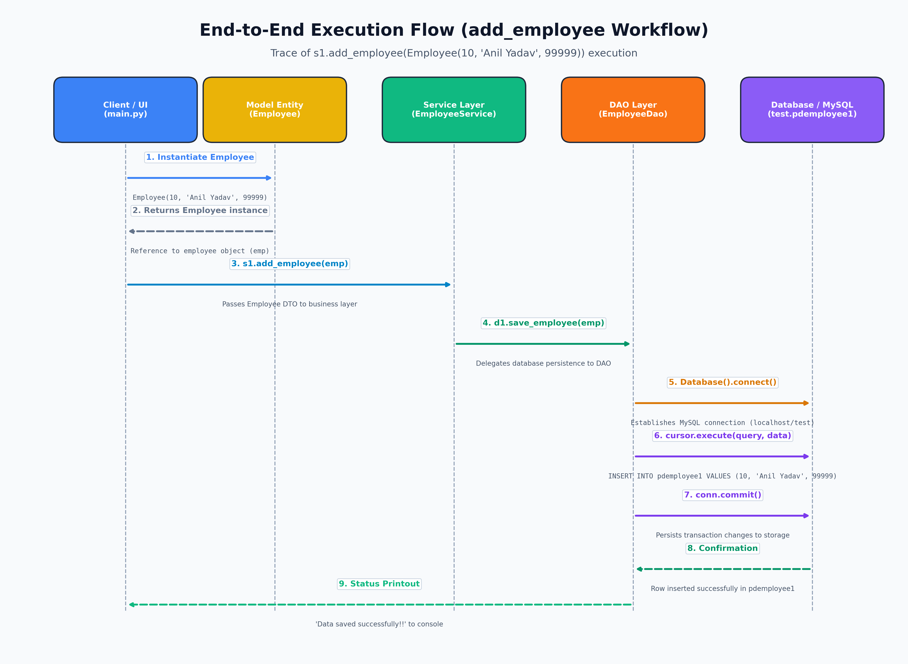

# Layered Architecture with Python Database Connectivity (PDBC)

A clean, enterprise-grade implementation of the **Layered (N-Tier) Architecture Pattern** using Python and MySQL.


## Overview

This project demonstrates how to structure a production-grade Python database application by strictly adhering to the **Separation of Concerns (SoC)** and **Single Responsibility Principle (SRP)**.

### Architecture Layers

1. **Presentation / Client Layer (`main.py`)**: UI and application entry point.
2. **Business Logic / Service Layer (`service/employee_service.py`)**: Validates business rules and coordinates workflows.
3. **Data Access Object Layer (`dao/employee_dao.py`)**: Prepares parameterized SQL queries and handles database transactions (`commit`/`rollback`).
4. **Infrastructure Layer (`database/connection.py`)**: Manages MySQL connection sockets and driver configuration.
5. **Cross-Cutting Model Layer (`model/employee.py`)**: Encapsulates data transfer objects (DTO) transferred cleanly across boundaries.

---

## Diagrams

### 1. Execution & Data Flow


### 2. Component Responsibility Matrix


### 3. UML Class Diagram & Database Schema


### 4. Monolithic Script vs. Layered Architecture


---

## Project Structure

```
Layered/
├── main.py                     # Entry point (Presentation Layer)
├── requirements.txt            # Project dependencies
├── .env.example                # Sample environment configuration
├── .gitignore                  # Git ignore rules
├── Architecture.md             # Complete in-depth theoretical guide
├── model/
│   └── employee.py             # Employee entity (Model / DTO)
├── service/
│   └── employee_service.py     # Business logic & orchestration (Service)
├── dao/
│   └── employee_dao.py         # Database access & SQL execution (DAO)
├── database/
│   └── connection.py           # MySQL connection factory
└── images/                     # 300 DPI architectural diagrams
```

---

## Getting Started

### 1. Prerequisites
- Python 3.8+
- MySQL Server running locally

### 2. Setup Virtual Environment
```bash
python3 -m venv venv
source venv/bin/activate
pip install -r requirements.txt
```

### 3. Configure Database
Create the database and target table in MySQL:
```sql
CREATE DATABASE test;
USE test;

CREATE TABLE pdemployee1 (
    id INT PRIMARY KEY,
    name VARCHAR(255) NOT NULL,
    salary DECIMAL(10, 2) NOT NULL
);
```

Set environment variables (optional, defaults to `localhost`/`root`):
```bash
cp .env.example .env
# Edit .env with your MySQL credentials
```

### 4. Run the Application
```bash
python3 main.py
```

---

## Theory Documentation
For the complete theoretical breakdown, design pattern explanations, and architectural analysis, refer to [Architecture.md](Architecture.md).
