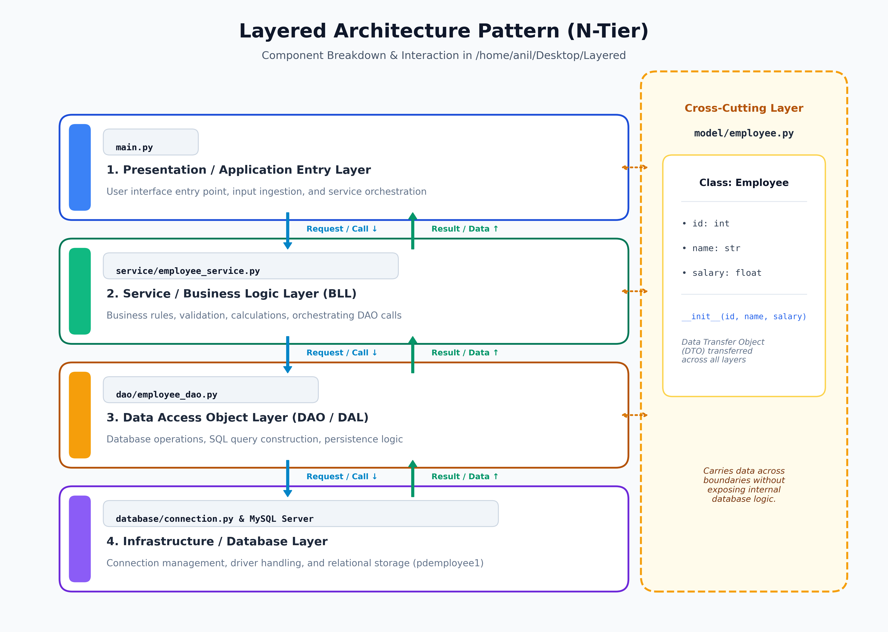
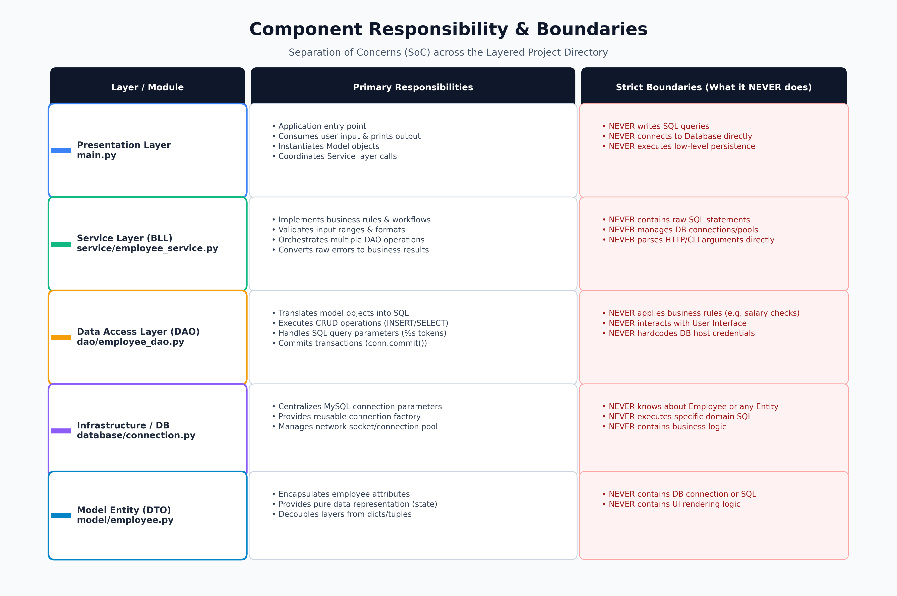
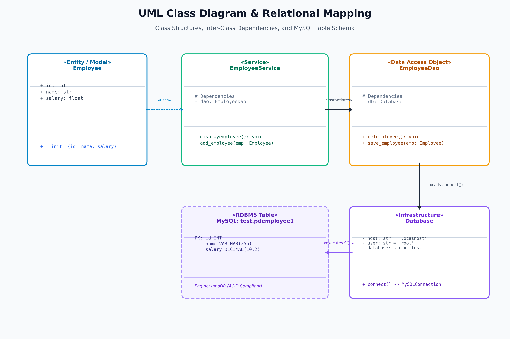
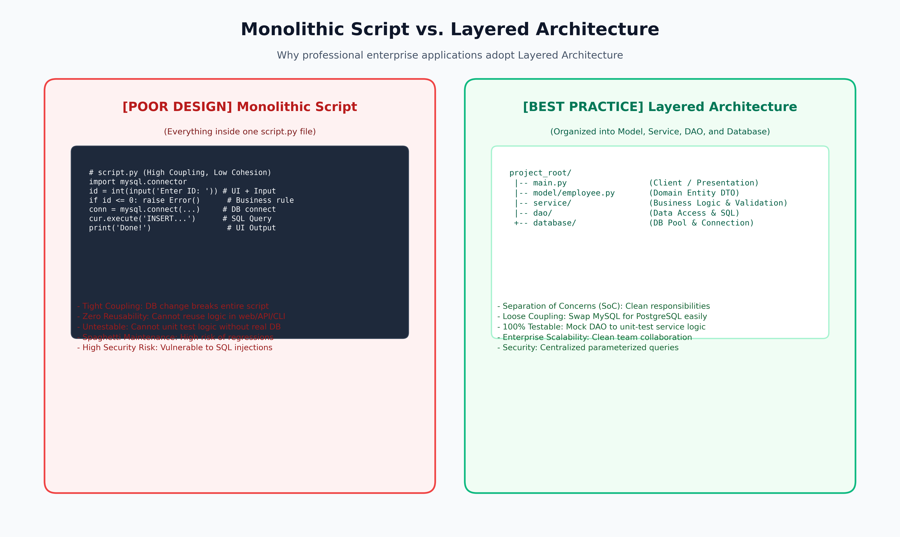

# Layered Architecture with Python Database Connectivity (PDBC)

A clean, enterprise-grade implementation of the **Layered (N-Tier) Architecture Pattern** using Python and MySQL.



## Overview

This project demonstrates how to structure a production-grade Python database application by strictly adhering to the **Separation of Concerns (SoC)** and **Single Responsibility Principle (SRP)**.

### Architecture Layers

1. **Presentation / Client Layer (`main.py`)**: CLI entry point handling user I/O, prompts, and formatted feedback.
2. **Business Logic / Service Layer (`service/employee_service.py`)**: Business rule validation and workflow orchestration across all CRUD operations.
3. **Data Access Object Layer (`dao/employee_dao.py`)**: Query formulation, `%s` parameter binding, transactional demarcation (`commit`), and object-relational hydration (`row` tuple to `Employee` entity).
4. **Infrastructure Layer (`database/connection.py`)**: Connection factory managing MySQL socket lifecycles and environment-based configuration.
5. **Cross-Cutting Model Layer (`model/employee.py`, `model/product.py`)**: Domain entities / DTOs transferred cleanly across boundaries without leaking relational database schemas.

### Implemented Capabilities (Full CRUD Lifecycle)
- **Create:** Instantiates domain object, delegates through service, issues parameterized `INSERT`, and commits transaction.
- **Read All:** Executes `SELECT *`, streams rows through `cursor.fetchall()`, hydratively transforms tuples into `Employee` objects, and closes connections cleanly.
- **Search (Read by ID):** Executes parameterized `SELECT ... WHERE id = %s` using `(id,)` tuple, fetches single row via `cursor.fetchone()`, and handles null checks (`None`).
- **Update:** Prepares `UPDATE ... WHERE id = %s`, binds `(name, salary, id)`, commits transaction, and evaluates `cursor.rowcount`.
- **Delete:** Executes parameterized `DELETE ... WHERE id = %s`, commits transaction, and verifies `cursor.rowcount`.

---

## Diagrams

### 1. Execution & Data Flow


### 2. Component Responsibility Matrix


### 3. UML Class Diagram & Database Schema


### 4. Monolithic Script vs. Layered Architecture


---

## Project Structure

```
LayeredArchitecture_Main/
├── main.py                     # Entry point (Presentation Layer)
├── requirements.txt            # Project dependencies
├── .env.example                # Sample environment configuration
├── .gitignore                  # Git ignore rules
├── README.md                   # Project overview & quickstart
├── theory/                     # Theory documentation & visual diagrams
│   ├── Architecture.md         # Full architecture and theory guide
│   └── images/                 # 300 DPI architectural diagrams
├── model/                      # Domain entities (DTOs)
│   ├── employee.py
│   └── product.py
├── service/                    # Business logic & orchestration (Service)
│   └── employee_service.py
├── dao/                        # Database access, SQL CRUD & Hydration (DAO)
│   └── employee_dao.py
├── database/                   # MySQL connection factory
│   └── connection.py
└── venv/                       # Virtual environment
```

---

## Getting Started

### 1. Prerequisites
- Python 3.8+
- MySQL Server running locally

### 2. Setup Virtual Environment
```bash
python3 -m venv venv
source venv/bin/activate
pip install -r requirements.txt
```

### 3. Configure Database
Create the database and target table in MySQL:
```sql
CREATE DATABASE test;
USE test;

CREATE TABLE pdemployee1 (
    id INT PRIMARY KEY,
    name VARCHAR(255) NOT NULL,
    salary DECIMAL(10, 2) NOT NULL
);
```

Set environment variables (optional, defaults to `localhost`/`root`):
```bash
cp .env.example .env
# Edit .env with your MySQL credentials
```

### 4. Run the Application
```bash
python3 main.py
```

---

## Theory & Code Walkthrough Guide
For a simple, step-by-step breakdown of your working code and the core theory behind it, refer to [theory/Architecture.md](theory/Architecture.md):
- **Part 1: Your Working Code (How It Runs)**: Clear step-by-step execution of all 5 CRUD operations.
- **Part 2: Core Theory (Made Simple)**: Easy explanations of the restaurant analogy, DTOs, data hydration, `conn.commit()`, and SQL security.
