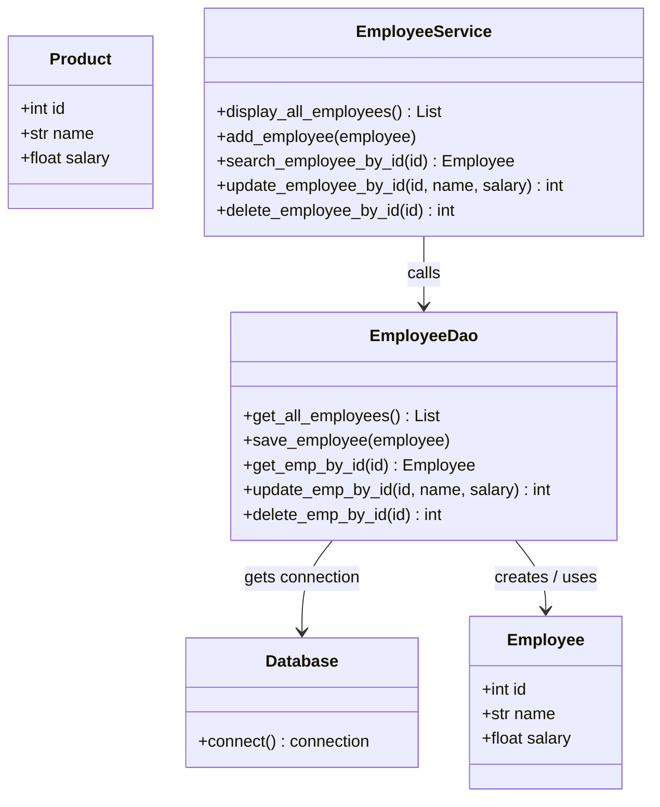

# Layered Architecture Guide: Simple & Practical

> A clean, easy-to-understand breakdown of your project. This guide separates **how your working code runs** from **the core theory** behind it.

---

## 📌 Quick Summary: The Restaurant Analogy

To understand why your code is divided into different folders and files, think of a **Restaurant**:

| Restaurant Role | Project Layer | File | Simple Job |
|---|---|---|---|
| **Waiter / Cashier** | **Presentation Layer** | [`main.py`](file:///home/anil/Desktop/LayeredArchitecture_Main/main.py) | Greets the user, asks for inputs (`input()`), and displays the final result. Never writes SQL or touches the database. |
| **Kitchen Manager** | **Service Layer** | [`service/employee_service.py`](file:///home/anil/Desktop/LayeredArchitecture_Main/service/employee_service.py) | Directs the order, checks business rules, and tells the DAO what to do. |
| **Storekeeper** | **DAO (Data Access) Layer** | [`dao/employee_dao.py`](file:///home/anil/Desktop/LayeredArchitecture_Main/dao/employee_dao.py) | Knows SQL. Connects to MySQL, runs queries, and packs data into clean objects. |
| **Warehouse** | **Database Layer** | [`database/connection.py`](file:///home/anil/Desktop/LayeredArchitecture_Main/database/connection.py) + MySQL | Opens the connection socket and stores data permanently in table `pdemployee1`. |
| **Food Tray / Plate** | **Model Layer (DTO)** | [`model/employee.py`](file:///home/anil/Desktop/LayeredArchitecture_Main/model/employee.py), [`model/product.py`](file:///home/anil/Desktop/LayeredArchitecture_Main/model/product.py) | Clean box/object holding `id`, `name`, `salary` so data moves neatly between layers. |

```
[ User / main.py ]  ──▶  [ employee_service.py ]  ──▶  [ employee_dao.py ]  ──▶  [ MySQL Database ]
       ▲                          ▲                             │
       │                          │                             │
       └────────────── Returns Employee Object(s) ──────────────┘
```

---

# 🚀 PART 1: Your Working Code (How It Runs)

Here is how each of your 5 implemented operations works step-by-step:

---

### 1. Add Employee (CREATE)

```
main.py ──▶ Employee(10, 'Anil', 99999) ──▶ Service.add_employee() ──▶ DAO.save_employee() ──▶ INSERT INTO MySQL
```

1. **In `main.py`:** You create an `Employee` object and send it to the service:
   ```python
   s1.add_employee(Employee(10, "Anil Yadav", 99999))
   ```
2. **In `employee_service.py`:** The service logs `"service adding new employee..."` and forwards the employee to the DAO:
   ```python
   d1 = EmployeeDao()
   d1.save_employee(employee)
   ```
3. **In `employee_dao.py`:** The DAO takes `employee.id`, `employee.name`, `employee.salary`, passes them safely into the SQL insert statement, and commits:
   ```python
   query = 'insert into pdemployee1(id,name,salary) values(%s,%s,%s)'
   data = (employee.id, employee.name, employee.salary)
   cursor.execute(query, data)
   conn.commit()  # Saves permanently!
   ```

---

### 2. Display All Employees (READ ALL)

```
main.py ──▶ Service.display_all_employees() ──▶ DAO.get_all_employees() ──▶ SELECT * ──▶ [Employee, Employee, ...]
```

1. **In `main.py`:** You ask the service for all employees and print each one in a loop:
   ```python
   Employees = s1.display_all_employees()
   for employee in Employees:
       print('ID:', employee.id)
       print('Name:', employee.name)
       print('Salary:', employee.salary)
   ```
2. **In `employee_service.py`:** The service calls the DAO and returns the list:
   ```python
   employees = d1.get_all_employees()
   return employees
   ```
3. **In `employee_dao.py`:** 
   - Runs `select * from pdemployee1`.
   - Uses `cursor.fetchall()` to grab all database rows.
   - Converts each database row into an `Employee` object:
     ```python
     employees = []
     for row in cursor.fetchall():
         employee = Employee(row[0], row[1], row[2])
         employees.append(employee)
     conn.close()
     return employees
     ```

---

### 3. Search Employee by ID (READ ONE)

```
main.py (input id) ──▶ Service.search_employee_by_id(id) ──▶ DAO.get_emp_by_id(id) ──▶ Employee or None
```

1. **In `main.py`:** You take input from user and check if the result is `None`:
   ```python
   id = int(input("Enter Employee id to search: "))
   employee = s1.search_employee_by_id(id)
   if employee is None:
       print("Employee not found")
   else:
       print('ID:', employee.id, 'Name:', employee.name, 'Salary:', employee.salary)
   ```
2. **In `employee_service.py`:** Passes the ID to the DAO:
   ```python
   employee = d1.get_emp_by_id(id)
   return employee
   ```
3. **In `employee_dao.py`:**
   - Runs `select * from pdemployee1 where id = %s` using `(id,)`.
   - Uses `cursor.fetchone()` to get one row.
   - If found, packs it into an `Employee` object; otherwise returns `None`:
     ```python
     if row is not None:
         return Employee(row[0], row[1], row[2])
     return None
     ```

---

### 4. Update Employee (UPDATE)

```
main.py (id, name, salary) ──▶ Service.update_employee_by_id() ──▶ DAO.update_emp_by_id() ──▶ UPDATE ... ──▶ rows count
```

1. **In `main.py`:** You take new name and salary from user:
   ```python
   id = int(input("Enter Employee id to search: "))
   name = input("Enter EmployeeName : ")
   salary = float(input("Enter Salary : "))
   rows = s1.update_employee_by_id(id, name, salary)
   if rows == 0:
       print("Data not found!")
   else:
       print("Data updated successfully...")
   ```
2. **In `employee_service.py`:** Delegates to DAO and returns the number of affected rows:
   ```python
   rows = d1.update_emp_by_id(id, name, salary)
   return rows
   ```
3. **In `employee_dao.py`:**
   - Executes `update pdemployee1 set name = %s, salary = %s where id = %s`.
   - Binds `(name, salary, id)`.
   - Calls `conn.commit()`.
   - Returns `cursor.rowcount` (tells whether any record was actually updated).

---

### 5. Delete Employee (DELETE)

```
main.py (input id) ──▶ Service.delete_employee_by_id(id) ──▶ DAO.delete_emp_by_id(id) ──▶ DELETE ... ──▶ rows count
```

1. **In `main.py`:**
   ```python
   id = int(input("Enter Employee id to search: "))
   rows = s1.delete_employee_by_id(id)
   if rows == 0:
       print("Data not found!")
   else:
       print("Data deleted successfully...")
   ```
2. **In `employee_service.py`:**
   ```python
   rows = d1.delete_emp_by_id(id)
   return rows
   ```
3. **In `employee_dao.py`:**
   - Executes `delete from pdemployee1 where id = %s` with `(id,)`.
   - Commits with `conn.commit()`.
   - Returns `cursor.rowcount` so `main.py` knows if anything got deleted.

---

# 📚 PART 2: Core Theory (Made Simple)

### Concept 1: Why Not Put Everything in One Single File?

| Single Script (Monolithic) | Layered Architecture (Our Project) |
|---|---|
| ❌ If MySQL password or table name changes, you must rewrite the whole script. | ✅ If database changes, you only touch `Database` or `DAO`. Your `main.py` never changes. |
| ❌ Very messy; user input, math calculations, and SQL queries are all mixed together. | ✅ Each file has **1 simple job** (Single Responsibility Principle). |
| ❌ Impossible to reuse. If you make a website tomorrow, you have to rewrite everything. | ✅ You can connect a Flask or FastAPI website to `EmployeeService` in 5 minutes! |

---

### Concept 2: Why Use Model Classes (`Employee`, `Product`)?

Instead of passing messy raw tuples like `(10, 'Anil', 99999.0)`, we create clean classes:
```python
class Employee:
    def __init__(self, id, name, salary):
        self.id = id
        self.name = name
        self.salary = salary
```
- **Clarity:** In `main.py`, you can easily do `employee.name` or `employee.salary` instead of confusing numbers like `row[1]` or `row[2]`.
- **Safety:** If the database table adds a column in the middle, `employee.name` still works!

---

### Concept 3: What is "Data Hydration"?
When MySQL returns data, it gives you raw rows of plain text/numbers:
```
Raw DB Tuple: (10, 'Anil Yadav', 99999.0)
```
In your DAO, you **hydrate** (convert) that raw tuple into a real Python object:
```python
employee = Employee(row[0], row[1], row[2])
```
Now it has become a full, proper `Employee` object ready for your application.

---

### Concept 4: Why is `conn.commit()` Required?
- When you run `SELECT`, you are only **reading** data. No changes are made.
- When you run `INSERT`, `UPDATE`, or `DELETE`, MySQL holds the changes in temporary memory.
- If you don't call `conn.commit()`, MySQL **cancels (rolls back)** the changes when your program exits!
- Therefore: **Always call `conn.commit()` after modifying data.**

---

### Concept 5: Why Use `%s` Instead of `f"..."` (SQL Injection)?

Look at this comparison:
- ❌ **Unsafe:** `query = f"DELETE FROM pdemployee1 WHERE id = '{id}'"`
  - If a user inputs `10 OR 1=1`, MySQL deletes **every single employee** in your table!
- ✅ **Safe (Your Code):** `query = "DELETE FROM pdemployee1 WHERE id = %s"`
  - MySQL treats the parameter strictly as a number or string, making hacking impossible.

---

### Concept 6: The Python Trailing Comma Rule: `(id,)` vs `(id)`
- In Python, writing `(id)` is just an integer in brackets. Python does **not** see it as a tuple!
- Writing `(id,)` with a trailing comma tells Python: *"This is a single-item tuple."*
- MySQL cursor requires a tuple for parameters, so `(id,)` is the correct syntax.

---

### Concept 7: How Does It Scale? (Your `Product` Model)
You also created [`model/product.py`](file:///home/anil/Desktop/LayeredArchitecture_Main/model/product.py):
```python
class Product:
    def __init__(self, id, name, price):
        self.id = id
        self.name = name
        self.price = price
```
Because the architecture is layered:
- `ProductDao` and `ProductService` follow the identical pattern without modifying any existing Employee code!
- Both services share the same central database connection in `database/connection.py`.

---

# 📊 Quick Reference UML Diagram



---

## 📋 Summary Table

| What to remember | Explanation in 1 sentence |
|---|---|
| **`main.py`** | Talks to the user and calls `EmployeeService`. |
| **`EmployeeService`** | Business brain; coordinates workflows and calls `EmployeeDao`. |
| **`EmployeeDao`** | Database worker; runs SQL queries and commits changes. |
| **`model/`** | Simple classes (`Employee`, `Product`) that package data neatly. |
| **`database/connection.py`** | One central place to connect to MySQL. |
